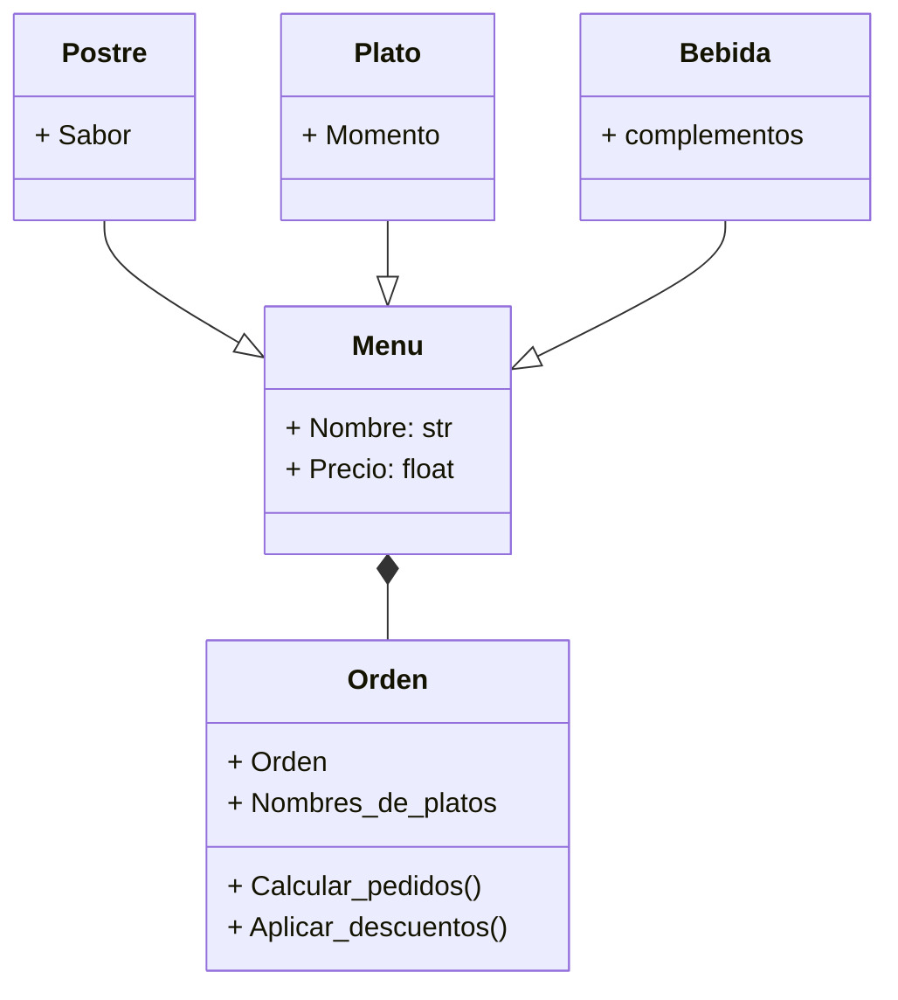

# Reto número tres

# Ejercicio de clase, punto 1:

```python
import math

class Punto:
  def __init__(self, x, y):
    self.x = x
    self.y = y
  def coordenada(self):
    return self.x, self.y

class Linea:

  def __init__(self):
    x = float(input("Ingrese la cordenada x del punto de inicio: "))
    y = float(input("Ingrese la cordenada y del punto de inicio: "))
    punto = Punto(x, y)
    nue_x, nue_y = punto.coordenada()
    self.punto_inicio = (nue_x, nue_y)
    x = float(input("Ingrese la cordenada x del punto de inicio: "))
    y = float(input("Ingrese la cordenada y del punto de inicio: "))
    punto = Punto(x, y)
    nue_x, nue_y = punto.coordenada()
    self.punto_final = (nue_x, nue_y)

  def computar_longitud(self):
    return ((self.punto_final[0] - self.punto_inicio[0])**2 + (self.punto_final[1] - self.punto_inicio[1])**2) ** 0.5

  def computar_pendiente(self):
    pendiente = (self.punto_final[1] - self.punto_inicio[1]) / (self.punto_final[0] -self.punto_inicio[0])
    pendiente_grados = math.degrees(math.atan(pendiente))
    return pendiente_grados

  def corte_x(self):
    if self.punto_inicio[1] <= 0 and self.punto_final[1] >= 0 or self.punto_inicio[1] >= 0 and self.punto_final[1] <= 0:
      return "Si hay un corte con el eje x"
    else:
      return "No hay corte con el eje x"

  def corte_y(self):
    if self.punto_inicio[0] <= 0 and self.punto_final[0] >= 0 or self.punto_inicio[0] >= 0 and self.punto_final[0] <= 0:
      return "Si hay un corte con el eje y"
    else:
      return "No hay corte con el eje x"

linea = Linea()
print(f"La cordenada del punto inicial es: {linea.punto_inicio}")
print(f"La cordenada del punto final es: {linea.punto_final}")
print(f"La longitud de la linea es: {linea.computar_longitud()}")
print(f"La pendiente en grado con respecto a x es: {linea.computar_pendiente()} grados")
print(f"{linea.corte_x()} y {linea.corte_y()}")
```

# Ejercicio de clase, punto 2:

```python
class Punto:

  def __init__(self, x, y):
    self.x = x
    self.y = y

  def coordenada(self):
    return self.x, self.y

class Linea:
  def __init__(self, x1, y1, x2, y2):
    self.x1 = x1
    self.y1 = y1
    self.x2 = x2
    self.y2 = y2
  def coordenadas(self):
    return [self.x1, self.y1, self.x2, self.y2]

class Rectangulo:

  def __init__(self):
    if metodo == 1:
      x = float(input("Ingrese la cordenada x de la ezquina inferior izquierda: "))
      y = float(input("Ingrese la cordenada y de la ezquina inferior izquierda: "))
      punto = Punto(x, y)
      nueva_x, nueva_y = punto.coordenada()
      self.ezquina_inf_izq = (nueva_x, nueva_y)
      self.ancho = float(input("Ingrese el ancho: "))
      self.largo = float(input("Ingrese el largo: "))
      x = self.ezquina_inf_izq[0] + (self.ancho/2)
      y = self.ezquina_inf_izq[1] + (self.largo/2)
      punto = Punto(x, y)
      nueva_x, nueva_y = punto.coordenada()
      self.centro = (nueva_x, nueva_y)
    elif metodo == 2:
      self.ancho = float(input("Ingrese el ancho: "))
      self.largo = float(input("Ingrese el largo: "))
      x = float(input("Ingrese la cordenada x del centro: "))
      y = float(input("Ingrese la cordenada y del centro: "))
      punto = Punto(x, y)
      nueva_x, nueva_y = punto.coordenada()
      self.centro = (nueva_x, nueva_y)
    elif metodo == 3:
      x = float(input("Ingrese la cordenada x de la ezquina inferior izquierda: "))
      y = float(input("Ingrese la cordenada y de la ezquina inferior izquierda: "))
      punto = Punto(x, y)
      nueva_x, nueva_y = punto.coordenada()
      self.ezquina_inf_izq = (nueva_x, nueva_y)
      x = float(input("Ingrese la cordenada x de la ezquina superior derecha: "))
      y = float(input("Ingrese la cordenada y de la ezquina superior derecha: "))
      punto = Punto(x, y)
      nueva_x, nueva_y = punto.coordenada()
      self.ezquina_sup_dere = (nueva_x, nueva_y)
      self.ancho = ((self.ezquina_sup_dere[0] - self.ezquina_inf_izq[0])**2 + (self.ezquina_sup_dere[1] - self.ezquina_sup_dere[1])**2) ** 0.5
      self.largo = ((self.ezquina_inf_izq[0] - self.ezquina_inf_izq[0])**2 + (self.ezquina_sup_dere[1] - self.ezquina_inf_izq[1])**2) ** 0.5
      x = self.ezquina_inf_izq[0] + (self.ancho/2)
      y = self.ezquina_inf_izq[1] + (self.largo/2)
      punto = Punto(x, y)
      nueva_x, nueva_y = punto.coordenada()
      self.centro = (nueva_x, nueva_y)
    elif metodo == 4:
      x1 = float(input("Ingrese la cordenada x de uno de los puntos de iniciales del ancho: "))
      y1 = float(input("Ingrese la cordenada y de ese mismo punto inicial del ancho: "))
      x2 = float(input("Ingrese la cordenada x del punto final del ancho correspondiente a la cordenada inicial: "))
      y2 = y1
      linea = Linea(x1, y1, x2, y2)
      nue_x1, nue_y1, nue_x2, nue_y2 = linea.coordenadas()
      self.linea_ancho = [nue_x1, nue_y1, nue_x2, nue_y2]
      self.y2 = float(input("Ingrese la cordenada y de uno de los puntos finales del largo, opuesto a los puntos y del inicio: "))
      self.ancho = ((self.linea_ancho[0] - self.linea_ancho[2])**2 + (self.linea_ancho[1] - self.linea_ancho[3])**2) ** 0.5
      self.largo = ((self.linea_ancho[2] - self.linea_ancho[2])**2 + (self.y2 - self.linea_ancho[3])**2) ** 0.5
      x = self.linea_ancho[0] + (self.ancho/2)
      y = self.linea_ancho[1] + (self.largo/2)
      punto = Punto(x, y)
      nueva_x, nueva_y = punto.coordenada()
      self.centro = (nueva_x, nueva_y)

  def computar_area(self):
    return(self.ancho * self.largo)

  def computar_perimetro(self):
    return((self.ancho*2) + (self.largo*2))

  def computar_interferencia(self):
    x = float(input("Ingrese la cordenada x del punto que desea conocer: "))
    y = float(input("Ingrese la cordenada y del punto que desea conocer: "))
    punto = Punto(x, y)
    nueva_x, nueva_y = punto.coordenada()
    self.punto_a_analizar = (nueva_x, nueva_y)
    if  ((self.centro[0]-(self.ancho/2)) >= self.punto_a_analizar[0]) or (self.punto_a_analizar[0] <= (self.centro[0]+(self.ancho/2)))  and ((self.centro[1]-(self.largo/2)) >= self.punto_a_analizar[1]) or (self.punto_a_analizar[1] <= (self.centro[1]+(self.largo/2))):
      return f"El punto con cordenadas: {self.punto_a_analizar} si esta interceptado en el "
    else:
      return f"El punto con cordenadas: {self.punto_a_analizar} no esta interceptado en el  "

class Cuadrado(Rectangulo):
    def __init__(self):
        super().__init__()


print(f"Metodos de creación del rectangulo: \n 1. Esquina inferior izquierda (punto) + ancho y alto \n 2. Centro (Punto) + ancho y alto \n 3. Dos esquinas opuestas (puntos), p. Abajo a la izquierda y arriba a la derecha \n 4. Cuatro cordenadas de dos lineas, una del ancho y otra del largo \n ")
metodo = int(input("Seleccione el metodo que desea: \n "))

if metodo != 1 and metodo != 2 and metodo != 3 and metodo != 4:
  raise ValueError("Por favor ingrese una opción valida")

rectangulo = Rectangulo()

if metodo == 1:
  print(f"El rectangulo es de {rectangulo.ancho} de ancho x {rectangulo.largo} de largo")
  print(f"El centro esta en la cordenada: {rectangulo.centro}")
  print(f"El punto de la ezquina injerior izquierda es: {rectangulo.ezquina_inf_izq}")

elif metodo == 2:
  print(f"El rectangulo es de {rectangulo.ancho} de ancho x {rectangulo.largo} de largo")
  print(f"El centro esta en la cordenada: {rectangulo.centro}")

elif metodo == 3:
  print(f"El rectangulo es de {rectangulo.ancho} de ancho x {rectangulo.largo} de largo")
  print(f"El centro esta en la cordenada: {rectangulo.centro}")
  print(f"El punto de la ezquina injerior izquierda es: {rectangulo.ezquina_inf_izq}  y el punto de la ezquina superior derecha es: {rectangulo.ezquina_sup_dere}")

elif metodo == 4:
  print(f"El rectangulo es de {rectangulo.ancho} de ancho x {rectangulo.largo} de largo")
  print(f"El centro esta en la cordenada: {rectangulo.centro}")


print(f"El área del rectangulo es: {rectangulo.computar_area()} y su perimetro: {rectangulo.computar_perimetro()}")
print(f"{rectangulo.computar_interferencia()} rectangulo \n")
print("Cuadrado:")
print("Recuerde un cuadrado debe ser igual en todos sus lados")
cuadrado = Cuadrado()
print(f"El área del cuadrado es: {cuadrado.computar_area()} y su perimetro: {cuadrado.computar_perimetro()}")
print(f"El centro del cuadrado es: {cuadrado.centro}")
print(f"{cuadrado.computar_interferencia()} cuadrado")
```
# Programa especial, restaurante:
1. Diagrama UML:



2. Programa:
   
```python
class Menu:

  def __init__(self, nombre, precio):
    self.nombre = nombre
    self.precio = precio

class Bebida(Menu):

  def __init__(self, nombre, precio, complementos):
    super().__init__(nombre, precio)
    self.complementos = complementos


class Plato(Menu):
  def __init__(self, nombre, precio, momento):
    super().__init__(nombre, precio)
    self.momento = momento

class Postre(Menu):
  def __init__(self, nombre, precio, sabor):
    super().__init__(nombre, precio)
    self.sabor = sabor

class Orden:
  def __init__(self):
    self.orden = ([int(pedido) for pedido in input("Ingrese su pedido por el número correspondiente al plato, separe por comas: ").split(',')])
    self.nombres_platos = list(menu.keys())
    self.calcular_pedido()  # Calcular el costo al instanciar la orden

  def calcular_pedido(self):
    self.costo = 0
    for items in self.orden:
        self.costo += menu[self.nombres_platos[items - 1]].precio
    return self.costo
  
  def descuentos(self):
    if self.costo > 50000:
      self.cost = self.costo * 0.93
      x = self.costo - self.cost
      return f"¡Aplica a 7% de descuento! Su orden ahora cuesta: {self.cost} ahorro: {x} gracias por comprar"

    elif self.costo > 100000:
      self.cost = self.costo * 0.8
      x = self.costo - self.cost
      return f"¡Aplica a 20% de descuento! Su orden ahora cuesta: {self.cost} ahorro: {x} gracias por comprar"
      
    else:
      return f"No hay descuento; total a pagar: {self.costo}"

  
cáfe = Bebida("Cafe", 2500, "Tamal")
jugo = Bebida("Jugo natural", 3500, "Arroz con pollo")
malteada = Bebida("Malteada", 5000, "Pastel de chocolate")
vino = Bebida("Vino", 12000, "Pasta")
tamal = Plato("Tamal", 6000, "Desayuno")
huevos = Plato("Huevos pericos", 5000, "Desayuno")
bandeja = Plato("Bandeja paisa", 13000, "Almuerzo")
frijoles = Plato("Frijoles con carne", 10000, "Almuerzo")
arroz = Plato("Arroz paisa", 15000, "Almuerzo")
pasta = Plato("Pasta con albondigas", 12000, "Cena")
ensalada = Postre("Ensalada de frutas", 12000, "dulse")
pastel = Postre("Pastel de chocolate", 8000, "dulse")
mango = Postre("Mango con limon", 4000, "acido")

menu = {"Cafe":cáfe, "Jugo natural":jugo, "Malteada":malteada, "Vino":vino, "Tamal":tamal, "Huevos pericos":huevos, "Bandeja paisa":bandeja,
        "Frijoles con carne": frijoles, "Arroz paisa":arroz, "Pasta con albondigas":pasta, "Ensalada de frutas":ensalada, "Pastel de chocolate":pastel, "Mango con limo":mango }


print("Opciones del menu: \n")
n = 1
for opciones in menu:
    if menu[opciones].nombre == "Cáfe":
      print("|Bebidas: \n")
    elif menu[opciones].nombre == "Tamal":
      print("   \n|Platos:\n")
    elif menu[opciones].nombre == "Ensalada de frutas":
      print("    \n|Postres:\n")
    print(f"{n}. {menu[opciones].nombre}: ${menu[opciones].precio}")
    n += 1
print("\n")

print("Opciones de descuento: \n Por compra superior a $50.000 7% de descuento \n Por compras superiores a $100.000 20% de descuento.")

orden = Orden()
print(f"{orden.descuentos()}")

